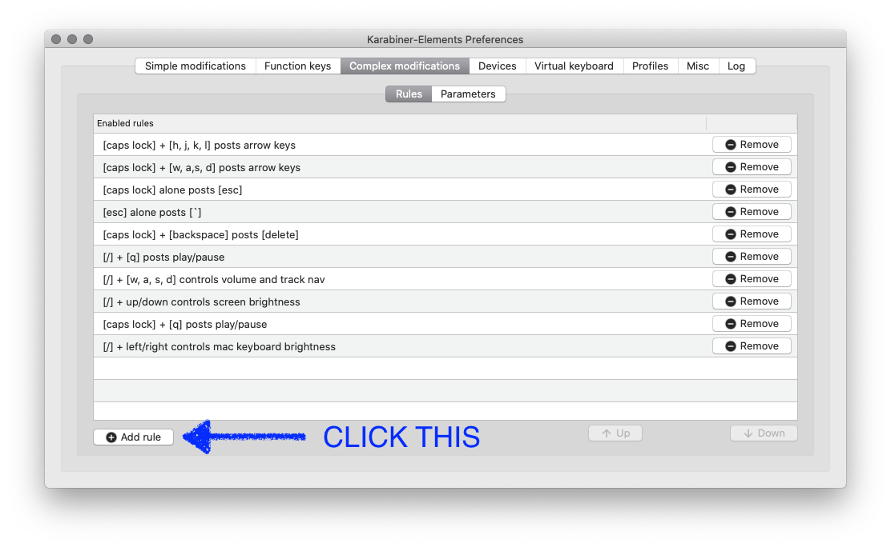

# Custom MacBook Keyboard Config
Free yourself of the terrible MacBook Pro Touch Bar (and pre-2019 arrow keys) with (some or all of) these changes:

- [caps lock] + [h, j, k, l] posts arrow keys
- [caps lock] + [w, a,s, d] posts arrow keys
- [caps lock] alone posts [esc]
- [esc] alone posts [`]
- [caps lock] + [backspace] posts [delete]
- [caps lock] + [q] posts play/pause
- [/] + [q] posts play/pause
- [/] + [w, a, s, d] controls volume and track nav
- [space] + [w, a, s, d] controls volume and track nav
- [/] + up/down controls screen brightness
- [/] + left/right controls mac keyboard brightness

## How to use this thing
1. Assuming you're on Mac, download Karabiner here: https://karabiner-elements.pqrs.org/
1. Copy the `mac-karabiner-rules/assets/complex_modifications/carlo.json` file from here into `~/.config/karabiner/assets/complex_modifications/` on your own machine.
1. In Karabiner's `Preferences > Complex modifications`, add the things you want/need in life.

## Inspiration
I made this after buying a Keychron K6 (68-key keyboard) and realizing there was no native support for configuring it to my preferences. 

This had a cool side-effect of applying the same config to the MacBook keyboard, which I'm down for, since I no longer have to rely on the Touch Bar for literally anything anymore (with the exception of FN keys).

Seriously, I _really_ dislike the Touch Bar. @Apple please release a new MacBook Pro variant with physical media/function keys.
